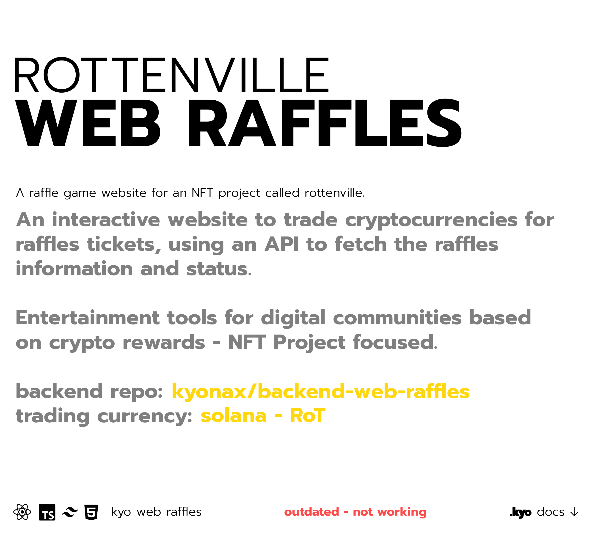

 

<a href="https://www.reddit.com/user/kyonax_on"><a/>

<a href="https://twitter.com/kyonax_on_tech" target="_blank"><a/>
<a href="https://www.instagram.com/is.kyonax/" target="_blank"><a/>
<a href="https://www.linkedin.com/in/kyonax/" target="_blank"><a/> 

  <a id="cover" href="#cover">
    <picture>
      <source media="(prefers-color-scheme: dark)" srcset="github/dark.png">
      
    </picture>
  </a>

